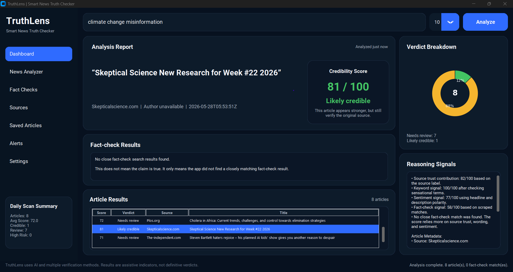

# TruthCheck: Smart News Truth Checker

TruthCheck is a Python desktop application for analysing news credibility risk. It fetches live news articles through NewsAPI, scrapes article-level metadata where available, searches fact-checking sources, applies NLP-based sentiment analysis, detects sensational keywords, calculates a 0 to 100 credibility score, and displays the results in a modern CustomTkinter dashboard with Matplotlib charts.
## Dashboard Preview

> Important: TruthCheck does not decide whether something is absolutely true or false. It gives assistive credibility indicators based on limited signals.


## Key Features
- Live article fetching through NewsAPI
- Offline demo mode when no API key is available
- BeautifulSoup scraping from Snopes and PolitiFact search pages
- VADER sentiment scoring
- Sensational keyword risk detection
- 0 to 100 credibility score
- Colour-ready verdict categories: Likely credible, Needs review, High risk
- - User-selectable article count: 5, 10, 15, or 20 articles
- Article webpage scraping for author, publication date, metadata, and readable text where available
- Modern CustomTkinter dashboard with article table, explanations, fact-check matches, scraped metadata, article preview, and Matplotlib chart
- Object-oriented design using multiple classes
- Unit tests using Python's built-in `unittest`

## Project Structure

```text
TruthCheck/
│
├── main.py
├── README.md
├── requirements.txt
├── .env.example
├── .gitignore
│
├── assets/
│   └── screenshots/
│       └── truthcheck-dashboard.png
│
├── truthcheck/
│   ├── __init__.py
│   ├── api_fetcher.py
│   ├── config.py
│   ├── dashboard.py
│   ├── data_processor.py
│   ├── models.py
│   ├── scorer.py
│   └── scrapers.py
│
└── tests/
    ├── test_api_fetcher.py
    ├── test_data_processor.py
    └── test_scorer.py
```
## OOP Design

The project follows an object-oriented structure.

| Class | Purpose |
|---|---|
| `Article` | Stores article data such as title, source, URL, content, score, and verdict. |
| `FactCheckResult` | Stores fact-check result data. |
| `APIFetcher` | Handles NewsAPI requests. |
| `ArticleDetailScraper` | Scrapes article pages for metadata and readable text. |
| `Scraper` | Abstract base class for fact-check scrapers. |
| `SnopesScraper` | Scrapes Snopes search results. |
| `PolitiFactScraper` | Scrapes PolitiFact search results. |
| `WebScraper` | Combines fact-check scrapers and filters irrelevant results. |
| `CredibilityScorer` | Calculates article credibility scores. |
| `DataProcessor` | Cleans and deduplicates article data. |
| `Dashboard` | Controls the graphical user interface. |

The project demonstrates encapsulation, inheritance, polymorphism, and modular design.

## Setup Instructions

### 1. Clone the repository

```bash
git clone https://github.com/YOUR_USERNAME/TruthCheck.git
cd TruthCheck
```

### 2. Create and activate a virtual environment

Windows:

```bash
python -m venv .venv
.venv\Scripts\activate
```

macOS or Linux:

```bash
python3 -m venv .venv
source .venv/bin/activate
```

### 3. Install dependencies

```bash
pip install -r requirements.txt
```

### 4. Add your NewsAPI key

Copy `.env.example` to `.env`:

Windows:

```bash
copy .env.example .env
```

macOS or Linux:

```bash
cp .env.example .env
```

Then edit `.env`:

```text
NEWS_API_KEY=your_real_key_here
```

Do not upload `.env` to GitHub.

## Running the App

Run the GUI:

```bash
python main.py
```

Run the terminal demo:

```bash
python main.py --cli --query "artificial intelligence"
```

## Running Tests

```bash
python -m unittest discover -s tests
```

## How the Score Works

The credibility score is calculated from four components:

1. Source trust score
2. Sensational keyword score
3. Sentiment intensity score
4. Fact-check match score

The score is intentionally simple and explainable, which makes it suitable for a programming assignment and video demonstration. It should not be presented as a production-grade misinformation detector.

## Ethical and Legal Considerations

TruthCheck uses web scraping only for academic demonstration. The scraping component is intentionally conservative and limited. It attempts to extract article metadata and readable text where available, but it does not bypass paywalls, login systems, bot protections, or JavaScript-only content.

If a website blocks scraping or uses an unsupported structure, the app falls back to API-provided data.

The fact-check scraping feature uses polite requests and keyword-based relevance filtering. The application does not claim to produce final truth judgments. Its credibility score is an assistive risk indicator, not a definitive verdict. 

## Limitations

- NewsAPI results depend on API availability and free-tier limits.
- Some article websites block scraping or hide metadata.
- Full article extraction does not work equally across all websites.
- Fact-check results may not exist for every topic.
- The credibility score is heuristic and should not be treated as absolute truth.
- Source trust scores are based on a predefined mapping and may need expansion.
- The app currently works as a desktop prototype rather than a deployed web application.

## Future Improvements

- Add better article extraction using newspaper3k or trafilatura.
- Add source credibility datasets.
- Add caching to reduce repeated API and scraping requests.
- Add user-selectable article count.
- Add export to CSV.
- Add more fact-check sources.
- Add keyword frequency visualization.
- Add date-based trend visualization.
- Improve fact-check matching using semantic similarity.
- Add clickable article links inside the dashboard.

## Disclaimer 
TruthCheck uses multiple signals to estimate credibility risk. The results are intended to support critical thinking and should not be treated as final verification. Users should always check the original article and trusted fact-checking sources before drawing conclusions.

## Author

- Ishrat Jahan Easha(26235135)
- Mohammad Shafiur Rahman(26277677)
- Tahmid Hassan Bhuiyan(25614001)

Data Science and Innovation 
University of Technology Sydney